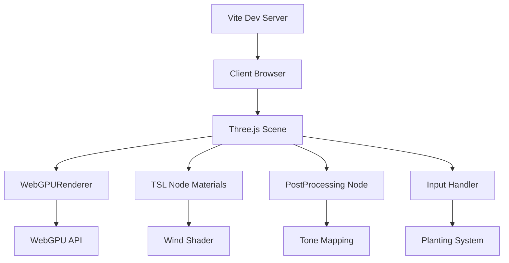

<!-- PRESERVATION RULE: Never delete or replace content. Append or annotate only. -->
# ARCHITECTURE

## System Overview
The game is a client-side web application built with Vite and Three.js.

## Rendering Engine
- **Three.js WebGPURenderer**: Utilizing the new WebGPU backend for performance and modern shading capabilities.

## Interaction Layer
- Simple mouse/touch events for planting and gardening actions.

